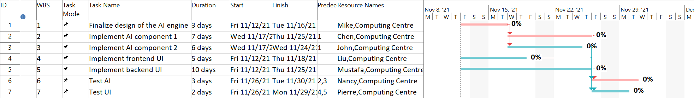
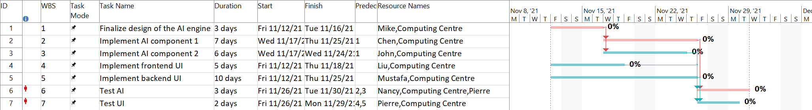
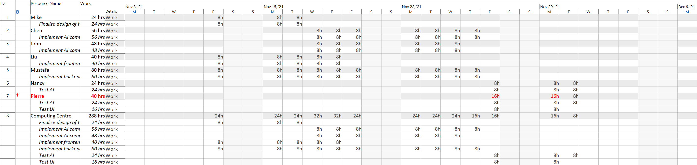
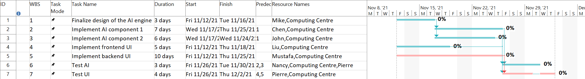

# Lab08 

## Rizvi Rab     300007282

-----------

## Task 1

B) 

C) The cost is estimated at $9430, assuming that each computer center can be used by one person and cost $100 a day each.

## Task 2

E) 

## Task 3

F) Yes

F.1) Pierre is over allocated since he is working on two different tasks at the same time. He is working 16 hour days.

F.4) 

F.5) The task 7 (Test UI) has been extended which is now causing it to become the current critical path versus before, it was the AI that was the critical path.

G) Technically, it can all be delivered in 3 weeks, but this is without any buffer time in case there is something that doesn't go to plan.
